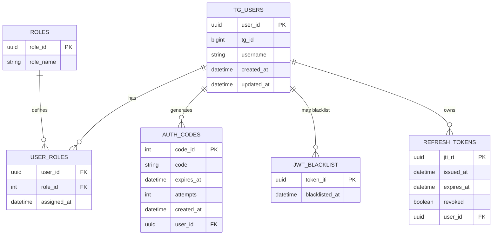

```sql
-- Справочник ролей
CREATE TABLE roles (
    role_id   SERIAL PRIMARY KEY,
    role_name VARCHAR(16) NOT NULL UNIQUE  -- 'user', 'admin', 'curator'
);

-- Пользователи Telegram
CREATE TABLE tg_users (
    user_id    SERIAL PRIMARY KEY,
    tg_id      BIGINT NOT NULL UNIQUE,
    username   VARCHAR(64),
    created_at TIMESTAMPTZ NOT NULL DEFAULT NOW(),
    updated_at TIMESTAMPTZ NOT NULL DEFAULT NOW()
);

-- Связь «пользователь <-> роль»
CREATE TABLE user_roles (
    user_id   INT NOT NULL REFERENCES tg_users(user_id) ON DELETE CASCADE,
    role_id   INT NOT NULL REFERENCES roles(role_id),
    assigned_at TIMESTAMPTZ NOT NULL DEFAULT NOW(),
    PRIMARY KEY (user_id, role_id)
);

-- Одноразовые коды для авторизации
CREATE TABLE auth_codes (
    code_id        SERIAL PRIMARY KEY,
    user_id        INT NOT NULL REFERENCES tg_users(user_id) ON DELETE CASCADE,
    code           CHAR(6) NOT NULL,
    expires_at     TIMESTAMPTZ NOT NULL,
    attempts       SMALLINT NOT NULL DEFAULT 0,
    created_at     TIMESTAMPTZ NOT NULL DEFAULT NOW()
    -- при успешной проверке кода удаляем запись
);

-- Чёрный список JWT
CREATE TABLE jwt_blacklist (
    token_jti      UUID PRIMARY KEY,
    blacklisted_at TIMESTAMPTZ NOT NULL DEFAULT NOW()
);

-- Таблица Refresh-токенов
CREATE TABLE refresh_tokens (
    jti_rt     UUID PRIMARY KEY DEFAULT gen_random_uuid(),
    user_id    UUID NOT NULL REFERENCES tg_users(user_id) ON DELETE CASCADE,
    issued_at  TIMESTAMPTZ NOT NULL DEFAULT NOW(),
    expires_at TIMESTAMPTZ NOT NULL,
    revoked    BOOLEAN NOT NULL DEFAULT FALSE
);

-- Индексы для ускорения запросов
CREATE INDEX idx_auth_codes_user_expires ON auth_codes(user_id, expires_at);

```
