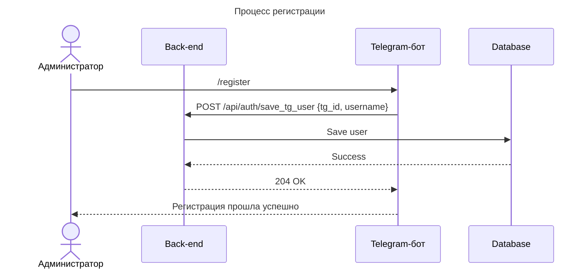
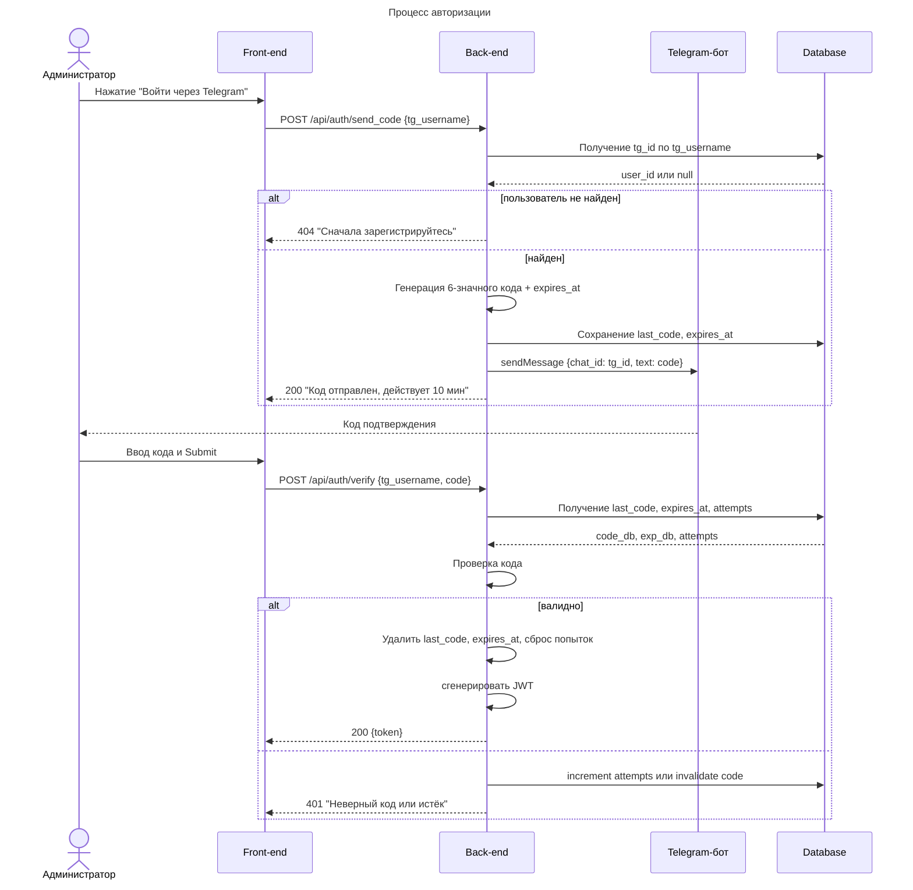
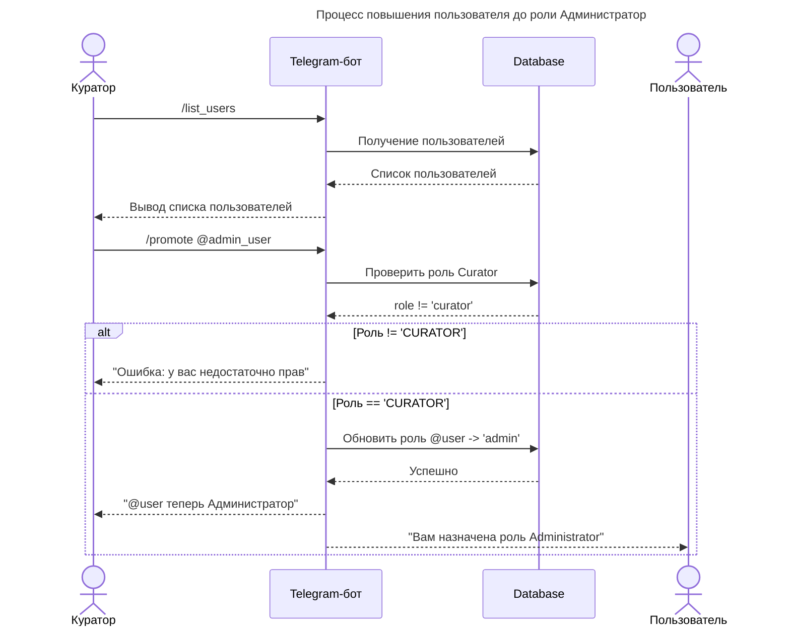
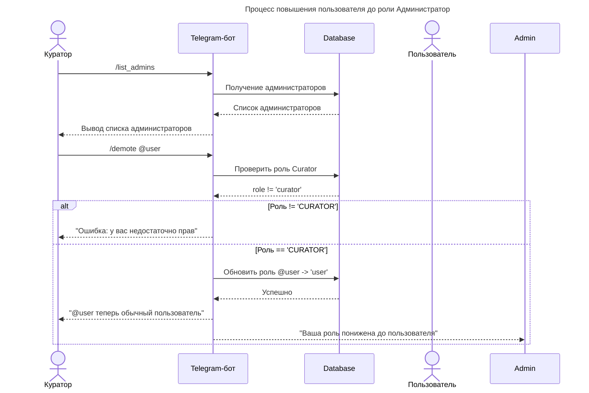

## Проблема

Для доступа к панели администратора нужны особые права, поэтому необходимо внедрить в систему механизм аутентификации пользователей. Важно использовать бесплатный инструмент идентификации и хранить минимум персональных данных.

## Сравнение способов аутентификации

| Метод идентификации                 | Плюсы                                                                                                                                                                                                    | Минусы                                                                                                                                                       |
| ----------------------------------- | -------------------------------------------------------------------------------------------------------------------------------------------------------------------------------------------------------- | ------------------------------------------------------------------------------------------------------------------------------------------------------------ |
| **По электронной почте**            | - Почти у всех пользователей есть email   - Простая и универсальная схема (пароль + подтверждение ссылки)  - Можно использовать бесплатные SMTP-сервисы (например, Gmail API, Mailgun free tier) | - Необходима реализация механизма отправки и обработки писем  - Риск попадания в спам  - Требуется хранить адреса                                    |
| **По номеру телефона**              | - Высокий уровень достоверности (SMS-подтверждение)  - Быстрая проверка через одноразовые коды                                                                                                       | - Большинство SMS-шлюзов платные или имеют ограниченный free-tier  - Нужно хранить номера телефона  - Зависимость от мобильного покрытия и оператора |
| **Через Telegram (код через бота)** | - Бесплатный API Telegram Bot для отправки кода   - Хранится минимум данных: только Telegram ID и временный код  - Плюс верификация через учётную запись мессенджера                             | - Необходим Telegram-аккаунт  - Зависимость от доступности Telegram API                                                                                  |

## Цель

Внедрить бесплатный и надежный механизм аутентификации через Telegram-бота, позволяющий администраторам входить в систему.

## Сценарии работы

### Создание пользователя в системе

1. Пользователь переходит в telegram бота и выполняет команду `/start`.
2. Бот отправляет пользователю сообщение "Привет! Для регистрации выполни команду `/register`".
3. Пользователь выполняет команду `/register`.
4. Бот отправляет в Backend API запрос на создание пользователя в системе.
5. Бот отправляет пользователю сообщение об успешной регистрации: "Ты зарегистрирован. Для повышения роли, обратись к куратору".

### Процесс авторизации пользователя в системе

1. Пользователь в веб-интерфейсе нажимает на кнопку "Войти через Telegram".
2. Бэкенд через телеграм-бота отправляет код авторизации в чат с пользователем.
3. Пользователь вводит код авторизации на сайте и попадает в панель администратора.

### Управление правами

#### Повышение роли пользователя

0. Проверка роли пользователя - если у пользователя есть роль куратора, то все ок. Если нет - "Ошибка: у вас недостаточно прав".
1. Куратор запрашивает список пользователей командой `/list_users`.
2. Куратор выполняет команду `/promote @user`.
3. Бот повышает роль указанного пользователя в системе до администратора.
4. Пользователю приходит уведомление в телеграм чат с ботом: "Теперь у вас есть права Администратора, ссылка на панель администратора: link".

#### Понижение роли пользователя

0. Проверка роли пользователя - если у пользователя есть роль куратора, то все ок. Если нет - "Ошибка: у вас недостаточно прав".
1. Куратор запрашивает список пользователей командой `/list_admins`, выбирает понравившегося
2. Куратор выполняет команду `/demote @user`
3. Бот повышает роль указанного пользователя в системе до администратора
4. Пользователю приходит уведомление в личные сообщения "Вы потеряли статус администратора."
5. Токен доступа к панели администратора тухнет.

